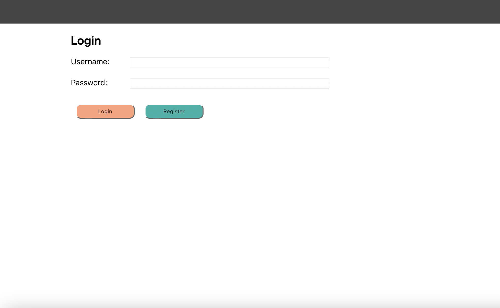

 
<h1 align="center">
WeTalk
</h1>
<p align="center">
React + Nodejs + Express + MongoDB + HTML5 + Heroku
</p>

## Authors
Weihong Yang | Yuan Wang

## Deploy on Heroku
https://mytwittera2.herokuapp.com/


## Description
- Web Development Project 3 : WeTalk
- Project Objective : Apply the concepts learned in class by building a basic fullstack application with React, Nodejs, Express, javascript, MongoDB and HTML5. Deploy on Heroku.

## Project Intro
- Create a social networking application where users broadcast and interact with short posts, user can follow others account and check followed list.

## Functionalities
- where user Register, Login and Logout. @Yuan Wang 
- List history posts, user can Broadcast & Delete posts. @Weihong Yang 
- Reply to certain posts & Comments, thumbs up/down certain posts. @Yuan Wang
- Follow/unFollow other users & followed/following/user list. @Weihong Yang

## Class Info
- Class Link: https://johnguerra.co/classes/webDevelopment_fall_2022/
- Professor: <a href="https://johnguerra.co/"> John Alexis Guerra Gómez </a>
- Release: <a href="https://mytwittera2.herokuapp.com/"> Here to Start </a>
- Demo: <a href="https://youtu.be/mB-5_2-avfo"> Video </a>


## Prerequirements
- [MongoDB](https://www.mongodb.com/3)
- [Node](https://nodejs.org/en/download/) v14.15.4
- [npm](https://nodejs.org/en/download/package-manager/)

## Instructions for Clone or Download
```terminal
$ git clone git@github.com:kuiyuanyuedui/project-3.git

run in client:
$ npm install	(change client/config.js --> export const baser = “”)
$ npm build  	(copy “ build/... "   --> server/public”)

run in server:  
$ npm install
$ npm start
Using your browser go to localhost: http://locahost:80/
```
## Screenshots Preview:
Login


Register


User Post


Comment


Following/Follower List


### License
[MIT](LICENSE)

